# Chat Plugin Registry Design - Visualizations

This document contains visual diagrams for the Chat Plugin Registry architecture described in [`chat-plugin-registry-design.md`](./chat-plugin-registry-design.md).

## 1. Plugin Registry Architecture Overview

```mermaid
graph TB
    subgraph "ChatPluginRegistry"
        Registry[Registry Core<br/>Map&lt;string, ChatPlugin&gt;]
        Config[Configuration<br/>Manager]
        Storage[Storage<br/>Factory]
    end

    subgraph "Plugin Ecosystem"
        Safety[Safety Processor<br/>🛡️<br/>• Moderation<br/>• PII Detection<br/>• Injection Prevention]
        Memory[Chat Memory<br/>🧠<br/>• Semantic Recall<br/>• Working Memory<br/>• Message History]
        Custom[Custom Tool<br/>⚙️<br/>• Domain Logic<br/>• Integrations]
        Analytics[Analytics<br/>📊<br/>• Metrics<br/>• Logging]
        Rubric[Rubric Feedback<br/>📋<br/>• Assessment<br/>• Grading]
    end

    subgraph "Processing Pipeline"
        Input[Input<br/>Processors]
        LLM[LLM<br/>Invocation]
        Output[Output<br/>Processors]
    end

    Registry --> Safety
    Registry --> Memory
    Registry --> Custom
    Registry --> Analytics
    Registry --> Rubric

    Safety --> Input
    Memory --> Input
    Custom --> Input

    Input --> LLM
    LLM --> Output

    Safety --> Output
    Memory --> Output
    Analytics --> Output

    Config --> Registry
    Storage --> Registry

    style Registry fill:#4169e1,stroke:#000,stroke-width:3px,color:#fff
    style Safety fill:#dc143c,stroke:#000,stroke-width:2px,color:#fff
    style Memory fill:#9370db,stroke:#000,stroke-width:2px,color:#fff
    style Custom fill:#20b2aa,stroke:#000,stroke-width:2px,color:#fff
    style Analytics fill:#ff8c00,stroke:#000,stroke-width:2px,color:#fff
    style Rubric fill:#32cd32,stroke:#000,stroke-width:2px,color:#fff
    style LLM fill:#ffd700,stroke:#000,stroke-width:3px,color:#000
```

## 2. Plugin Lifecycle State Machine

## 3. Request Flow with Plugin Processing

## 4. Plugin Interface Hierarchy

## 5. Streaming Tool State Machine

## 6. Data Persistence & Storage Architecture

## 7. UI Integration Pattern

```mermaid
graph LR
    subgraph "UnifiedChat Component"
        Header[Chat Header<br/>🎯 Placement: chat-header]
        Messages[Message List]
        Input[Input Area<br/>🎯 Placement: input-toolbar]
        Footer[Footer<br/>🎯 Placement: chat-footer]
        Sidebar[Sidebar<br/>🎯 Placement: sidebar-widget]
    end

    subgraph "PluginUISlot System"
        Slot1[PluginUISlot<br/>placement='chat-header']
        Slot2[PluginUISlot<br/>placement='message-decorator']
        Slot3[PluginUISlot<br/>placement='input-toolbar']
        Slot4[PluginUISlot<br/>placement='sidebar-widget']
    end

    subgraph "Plugin Components"
        MemoryIndicator[Memory Indicator<br/>🧠 Chat Memory Plugin]
        SafetyWarning[Moderation Warning<br/>🛡️ Safety Plugin]
        ToolbarButton[Custom Button<br/>⚙️ Custom Plugin]
        ForgetButton[Forget Button<br/>🗑️ Memory Plugin]
    end

    Header --> Slot1
    Messages --> Slot2
    Input --> Slot3
    Sidebar --> Slot4

    Slot1 -.renders.-> MemoryIndicator
    Slot2 -.renders.-> SafetyWarning
    Slot3 -.renders.-> ToolbarButton
    Slot4 -.renders.-> ForgetButton

    Registry[ChatPluginRegistry] -.provides components.-> Slot1
    Registry -.provides components.-> Slot2
    Registry -.provides components.-> Slot3
    Registry -.provides components.-> Slot4

    style Header fill:#e6f3ff,stroke:#333,stroke-width:2px
    style Messages fill:#e6f3ff,stroke:#333,stroke-width:2px
    style Input fill:#e6f3ff,stroke:#333,stroke-width:2px
    style Footer fill:#e6f3ff,stroke:#333,stroke-width:2px
    style Registry fill:#4169e1,stroke:#000,stroke-width:3px,color:#fff
```

## 8. Streaming Pipeline with Plugin Processors

## 9. Plugin Configuration Hierarchy

## 10. Plugin Tool Renderer Pattern

## Diagram Index

1. **Plugin Registry Architecture** - High-level system overview
2. **Plugin Lifecycle** - State transitions from registration to destruction
3. **Request Flow** - Sequence of plugin interactions during chat processing
4. **Interface Hierarchy** - TypeScript class relationships
5. **Streaming State Machine** - Tool call state transitions
6. **Data Persistence** - Storage architecture and scoping
7. **UI Integration** - Component placement and slot system
8. **Streaming Pipeline** - Real-time processing with processors
9. **Configuration Hierarchy** - Config merging strategy
10. **Tool Renderer Pattern** - Custom tool rendering system

Each diagram corresponds to a major section in the [`chat-plugin-registry-design.md`](./chat-plugin-registry-design.md) document.
